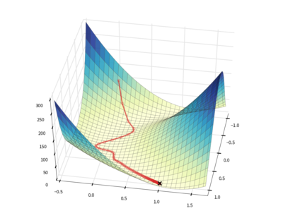

The ``downhill`` package provides algorithms for minimizing scalar loss
functions that are defined using Theano_.

Several optimization algorithms are included:

- :class:`Stochastic Gradient Descent <downhill.first_order.SGD>`
- :class:`Nesterov's Accelerated Gradient <downhill.first_order.NAG>`
- :class:`Resilient Backpropagation <downhill.adaptive.RProp>`
- :class:`ADAGRAD <downhill.adaptive.ADAGRAD>`
- :class:`RMSProp <downhill.adaptive.RMSProp>`
- :class:`Equilibrated SGD <downhill.adaptive.ESGD>`
- :class:`Adam <downhill.adaptive.Adam>`
- :class:`ADADELTA <downhill.adaptive.ADADELTA>`

All algorithms permit the use of regular or Nesterov-style momentum as well.

The source code for ``downhill`` lives at http://github.com/lmjohns3/downhill,
the documentation lives at http://downhill.readthedocs.org, and announcements
and discussion happen on the `mailing list`_.

.. _Theano: http://deeplearning.net/software/theano/
.. _mailing list: https://groups.google.com/forum/#!forum/downhill-users

Quick Start: Matrix Factorization
=================================

Let's say you want to compute a sparse, low-rank approximation for some
1000-dimensional data that you have lying around. You can represent a batch of
:math:`m` of data points :math:`X \in \mathbb{R}^{m \times 1000}` as the product
of a sparse coefficient matrix :math:`U \in \mathbb{R}^{m \times k}` and a
low-rank basis matrix :math:`V \in \mathbb{R}^{k \times 1000}`. You might
represent the loss as

.. math::

   \mathcal{L} = \| X - UV \|_2^2 + \alpha \| U \|_1 + \beta \| V \|_2

where the first term represents the approximation error, the second represents
the sparsity of the representation, and the third prevents the basis vectors
from growing too large.

This is pretty straightforward to model using Theano. Once you set up the
appropriate variables and an expression for the loss, you can optimize the loss
with respect to the variables using a single call to :func:`downhill.minimize`::

  import climate
  import downhill
  import numpy as np
  import theano
  import theano.tensor as TT

  climate.enable_default_logging()

  def rand(a, b): return np.random.randn(a, b).astype('f')

  A, B, K = 20, 5, 3

  # Set up a matrix factorization problem to optimize.
  u = theano.shared(rand(A, K), name='u')
  v = theano.shared(rand(K, B), name='v')
  e = TT.sqr(TT.matrix() - TT.dot(u, v))

  # Minimize the regularized loss with respect to a data matrix.
  y = np.dot(rand(A, K), rand(K, B)) + rand(A, B)

  downhill.minimize(
      loss=e.mean() + abs(u).mean() + (v * v).mean(),
      train=[y],
      batch_size=A,                 # Process y as a single batch.
      max_gradient_norm=1,          # Prevent gradient explosion!
      learning_rate=0.1,
      monitors=(('err', e.mean()),  # Monitor during optimization.
                ('|u|<0.1', (abs(u) < 0.1).mean()),
                ('|v|<0.1', (abs(v) < 0.1).mean())),
      monitor_gradients=True)

  # Print out the optimized coefficients u and basis v.
  print('u =', u.get_value())
  print('v =', v.get_value())

Documentation
=============

.. toctree::
   :maxdepth: 2

   guide
   reference

Indices and tables
==================

- :ref:`genindex`
- :ref:`modindex`
